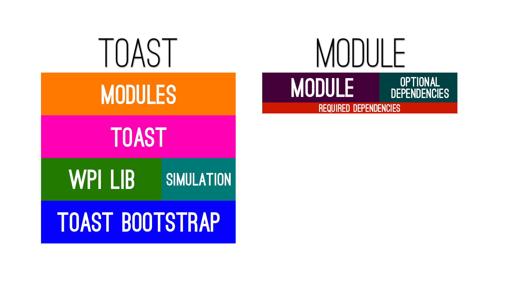
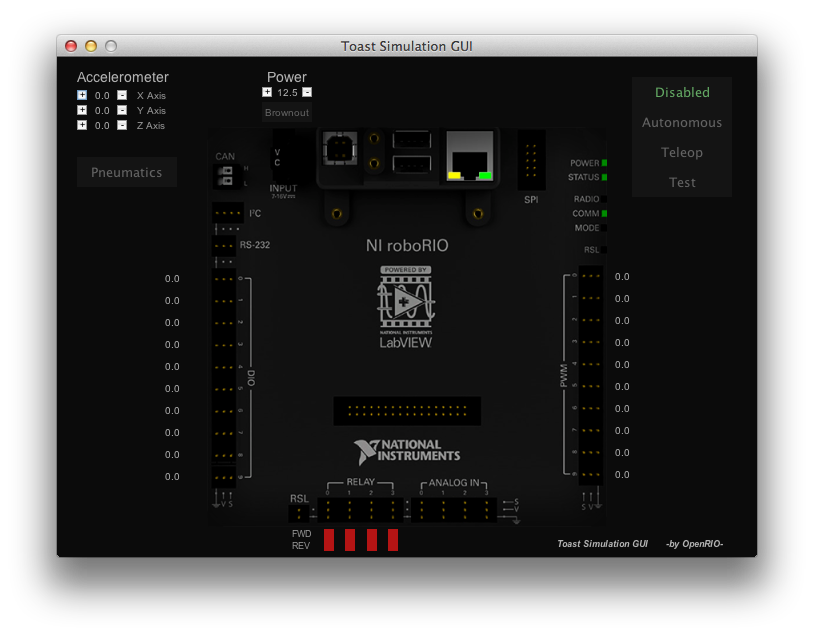

#
An expandable, Open Source and Cross-Platform Robot API for FRC built on WPILib  

Travis CI Build Status:  
[](https://travis-ci.org/Open-RIO/ToastAPI/)  

[Current Whitepaper](http://www.chiefdelphi.com/media/papers/3148)  
[Current Metrics](https://dev.imjac.in/toast/metrics/)  

## Table of Contents
- [What is Toast?](#what-is-toast)
  - [Simulation](#simulation)
  - [Configuration and Scripting](#configuration-and-scripting)
  - [Crash and Logging](#crash-and-logging)
  - [Expansion and Storage](#expansion-and-storage)
  - [Commands](#commands)
  - [Security](#security)
    - [Ports and Networking](#ports-and-networking)
  - [Others](#others)
- [Deployment](#deployment)
  - [Module Deployment](#module-deployment)
- [Developing a Module](#developing-a-module)
- [Reporting Bugs](#reporting-bugs)
- [Contributions](#contributions)

# What is Toast?
Toast is an API designed for the RoboRIO and teams competing in the FIRST Robotics Competition. Toast is built on top of WPILib and provides useful tools for increased stability, ease of use and usability. Toast also features a full Robot Simulation tool, meaning Robot Code can be tested at school, home, or even on the plane to the next match.

Toast is modular, and is designed with a core. This core is loaded no matter what and contains essential tools such as Logging, Crash Handling and of course, Module Loading. Modules are code that use Toast and WPILib as a base API and can be loaded/unloaded at will. These are stored in .jar files much like any other program and are loaded at Runtime. This allows for an extremely modular workflow in Toast. Modules can be written in a variety of languages, including Java, JavaScript natively, and even Ruby, Groovy, LUA and others through the help of other Modules.

Teams create their own Module to control their robot, but might choose to load other modules as well, such as a WebUI, Autonomous Recorder or even Vision Tracking. Modules can be optional, or depend on each other. This allows for the FIRST community to share their code and creations on a whole new level. A brief visual representation of how Toast loads and organized modules is given below:


## Simulation
  Simulation is one of the staple features of Toast, and allows for teams to test their code without having a robot present. This is done Natively, and no extra programs are needed. If Toast detects a simulation environment, we'll go ahead and start up a little GUI for you, which helps display all the relevant details including Digital IO, PWM, Relay, Analog and allows you to change Robot State, Battery Voltage and even Accelerometer Information. By extension, Joysticks can also be simulated.

  

## Configuration and Scripting
  By default, Toast comes packaged with a JavaScript interface thanks to the Oracle Nashorn Project. Toast uses this JavaScript implementation to allow for easy JSON Configuration Files, as well as to allow modules to extend their functionality. Modules can be written in Java, but can also be written entirely in JavaScript as well, allowing for a versatile combination of languages.

  Configuration Files are automatically generated, and are formatted in the familiar JSON syntax. For example, here's Toast.
  ``` JavaScript
  {
      "delegate": {
          "command": {
              "algorithm": "SHA256",
              "password": ""
          },
          "logger": {
              "password": "",
              "algorithm": "SHA256"
          }
      },
      "security": {
          "policy": "STRICT"
      },
      "threading": {
          "pool_size": 4
      },
      "optimization": {
          "gc": {
              "enabled": false,
              "time": 30
          }
      },
      "experimental": {
          "threaded_loading": false
      }
  }
  ```


## Crash and Logging
Robots Crash. A lot. Whether it's programmatically or physically, something needs to be done, so lets fix both.  
Toast includes a logging system that uses a formatter to make the log from Toast and it's modules nice and readable. Additionally, these logs are also saved to file for you to read from later.  
```
.________    ______                 __
((       )  /_  __/___  ____ ______/ /_
||  o o  |   / / / __ \/ __ `/ ___/ __/
||   3   |  / / / /_/ / /_/ (__  ) /_
\\_______/ /_/  \____/\__,_/____/\__/

[05/07/15-06:46:03] [Toast] [Bootstrap] [INFO] Toast Version: 2.0.0
[05/07/15-06:46:03] [Toast] [Core-Initialization] [INFO] Toast Started with Run Arguments: [-sim, --search]
[05/07/15-06:46:03] [Toast] [Pre-Initialization] [INFO] Slicing Loaf...
[05/07/15-06:46:05] [Toast] [Initialization] [INFO] Nuking Toast...
[05/07/15-06:46:05] [Toast] [Pre-Start] [INFO] Buttering Bread...
[05/07/15-06:46:05] [Toast] [Start] [INFO] Fabricating Sandwich...
[05/07/15-06:46:05] [Toast] [Start] [INFO] Verdict: Needs more salt
[05/07/15-06:46:05] [Toast] [Main] [INFO] Total Initiation Time: 2.98 seconds

```

Now let's say your Robot crashes. First thing that happens is Toast formats the crash log to include all the vital information: Loaded Modules, Environment Data, Crash Stacktrace and Toast Version. Toast also saves this Crash Log to a file with the Time Stamp of the crash, too.
```
**** CRASH LOG ****
Your robot has crashed. Following is a crash log and more details.
This log has been saved to: D:\Programming\FRC\OpenRIO\Toast\run\toast\crash\crash-2015-07-05_06-48-37.txt
 ________     __  ____       ____  __
((       )   / / / / /_     / __ \/ /_
||  x x  |  / / / / __ \   / / / / __ \
||   ^   | / /_/ / / / /  / /_/ / / / /
\\_______/ \____/_/ /_/   \____/_/ /_/

java.lang.Exception: Invoked Debug Crash
	at jaci.openrio.toast.core.command.cmd.CommandInvokeCrash.invokeCommand(CommandInvokeCrash.java:35)
	at jaci.openrio.toast.core.command.CommandBus.parseMessage(CommandBus.java:78)
	at jaci.openrio.toast.core.command.CommandBus$1.run(CommandBus.java:167)

Crash Information:
	Toast:
		Toast Version: 2.0.0
		Loaded Modules:

	Environment:
		    Toast: 2.0.0
		     Type: Simulation
		      FMS: false
		       OS: Windows 8.1 6.3 (amd64)
		     Java: 1.8.0_25 (Oracle Corporation)
		Java Path: C:\Program Files\Java\jdk1.8.0_25\jre
		  JScript: Supported (Nashorn)


*******************
```
Next up, Toast stops all the Motors on the RoboRIO, all working Threads are killed and Network Connections disconnected. All this helps to ensure your Robot doesn't destroy everything if it crashes.

## Expansion and Storage
The RoboRIO doesn't have a lot of space, which becomes a problem for modules that like to take up a lot of disk space. To ensure the RoboRIO doesn't destroy its filesystem, Toast has support for USB Mass Storage devices. In short, USB drives can be used to either Override all the modules on the RoboRIO, or run modules alongside them. Data Dumps can be done to USB devices, as well as data restoring. USB Drives can be of any size, 1GB, 2GB, hell, even 64GB. It's up to you.

## Commands
Toast aims to be as flexible as possible, and as such, we provide a CommandBus implementation. The Command Bus can be accessed through the RoboRIO, Remote Console or even a Web UI or Mobile Device. The Command Bus simply takes a text input from the user, and parses it to an operation. Modules can add their own commands, or even invoke them. Commands are used to give an easy interface between the User and the Robot while the code is running.

## Security
In the odd event that a module goes haywire, Toast has security implementations to make sure the modules doesn't Nuke your RoboRIO.  
In the Toast Configuration, a user can select STRICT, LOOSE or NONE as a security policy. STRICT will deny unauthorized actions, while LOOSE will only warn the user.

### Ports and Networking
Modules are given freedom in which ports they choose. STRICT and LOOSE will act the same in this setting, where STRICT will not block, only warn. Any ports outside of the 5800 - 5810 range will send a warning to the user, as ports outside of this range will NOT be forwarded by FMS. This is a precaution so people don't go mad when FMS doesn't forward their ports and their robot doesn't work on the first match.  

## Others
Many other tools are available to the Toast User, but those that haven't been listed in this readme can be found in the Toast Whitepaper.  

# Deployment
Toast deployment is easily taken care of by [ButterKnife](https://github.com/Open-RIO/ButterKnife).  
To deploy the latest version of Toast to your RoboRIO, simply download ButterKnife from the [ButterKnife releases](https://github.com/Open-RIO/ButterKnife/releases).  
On Windows, double click the ``` butterknife.exe ``` file.  
On Linux or Mac, run ``` ruby butterknife ```.


## Module Deployment
  To deploy a module to your RoboRIO, it's recommended to use a USB Drive.
  - Plug your USB into the RoboRIO and run ``` usb generate ``` if you haven't already. Restart your RoboRIO after this step.
  - Plug your USB into your computer and copy your module to ``` toast/modules ``` on your USB.
  - Plug your USB back into your RoboRIO and you're done

# Developing a Module

Developing a Module for Toast can be done in many ways, and as such, we've moved Module Development to the [Toast Wiki](https://github.com/Open-RIO/ToastAPI/wiki)

# Reporting Bugs
Find something wrong with Toast? Think it needs more butter, or just isn't Toasted enough? Great! Head over to our [issues page](https://github.com/Open-RIO/ToastAPI/issues) and see if your issue has already been submitted. If it hasn't, go ahead and hit 'new issue' and give us a detailed description of what's wrong. If possible, we'd like you to include as much of the following information possible so we can track down that bug and squash it as quickly as possible.  
- A brief description of the issue (e.g. During teleop the robot crashes for no apparent reason)
- How severe the crash is (e.g. It freezes for a few seconds, it crashes, help my roborio is on fire)
- A crash log if available (crash logs can be found in toast/crash/)
- If needed, a regular console log would be helpful (found in toast/log/)
- A list of modules, as well as what version of Toast you're on (module list isn't required if the robot has crashed, this is included in the crash log)
- Your thoughts on the bug (Think you know what caused it? Spill the beans!)

Got a feature request? Submit a new issue, but apply the 'Feature Request' label to it. We'll be sure to look at your suggestions!

Thanks for submitting your bugs and helping us improve Toast!

# Contributions
We're Open Source, which means we're open to contributions. Got something you want to add, or know how to fix an issue? Go ahead! Fork our repo and change it to your heart's desire. Just be sure to stick to the following terms:
- Stick to the license. This means ours, as well as that of WPILib
- Document it. If you're adding something new, add some JavaDoc comments to your class. Something descriptive and brief
- Credit yourself! Add @author to your JavaDoc comments so people can thank you
- Submit it to us via Pull Request. This makes it easy for us to merge your changes

Thanks for helping improving Toast!  

# Why did I call it 'Toast'?  
Toast is modular. So is regular Toast. Want butter? Go ahead, add it! Jam more your style? Whatever, jam it up, baby! Want to make a sandwich? Make the best sandwich the world has ever seen.  
